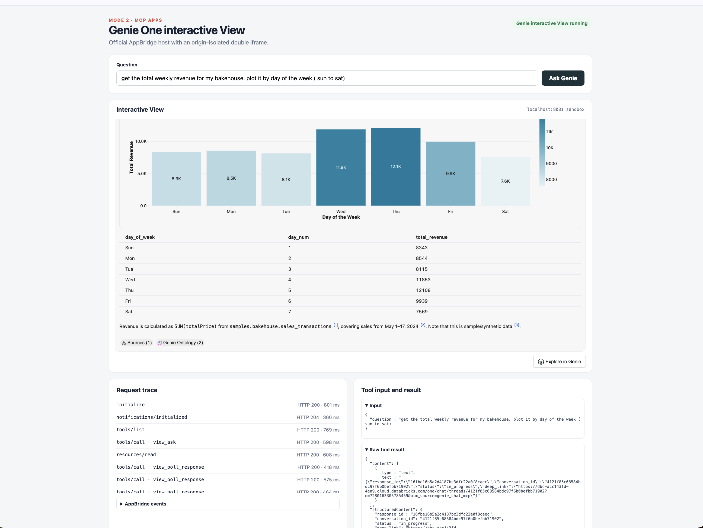
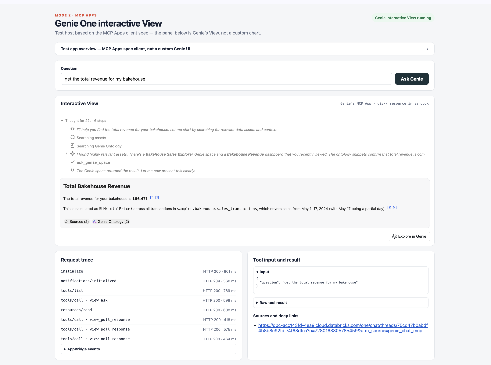

# Integrating with Genie One

This folder is a **local test suite** for calling Databricks **Genie One** from
your own client. Genie One is the workspace-wide, ontology-grounded analytics
coworker: a client sends a natural-language question; Genie One searches governed
data, writes SQL, and returns an answer with citations. Unity Catalog
permissions apply on every call.

These examples are not a production product. They are three **Genie One**
integration tests:

1. **Headless MCP over REST JSON-RPC** — poll until the answer is ready.
2. **MCP Apps client** — advertise UI support and render **Genie One’s own View**
   (progress, charts, citations) in an iframe. Connection settings come from
   a local `.env`.
3. **MCP Apps UI with a connection screen** — same Genie One View as Mode 2, but
   the user first enters workspace host, OAuth client ID, client secret, and
   redirect URL in the app, then authenticates. Only after that can they ask
   a question.

All of these use OAuth U2M against Unity Gateway (`ai-gateway`).

## Choose an integration path

| Path | When to use it | Protocol | OAuth scope | Status |
|------|----------------|----------|-------------|--------|
| **Genie One MCP, text tools** | Headless agents, services, CLIs. You own rendering. | JSON-RPC `POST` to the MCP Service | `ai-gateway` | GA |
| **Genie One MCP + MCP Apps** | Product UIs that can host an iframe (Claude Desktop, custom host). | Same MCP Service, plus the MCP Apps extension | `ai-gateway` | GA |

**Default for most partner/agent integrations today:** Genie One MCP. Use MCP
Apps only if the client implements the [MCP Apps specification](https://github.com/modelcontextprotocol/ext-apps/blob/main/specification/2026-01-26/apps.mdx). Do **not** call a specific Genie Agent (`/api/2.0/mcp/genie/{space_id}` or Agent Mode) unless you need a single curated domain instead of workspace-wide Genie One.

### Docs

- [Genie One MCP server](https://docs.databricks.com/aws/en/agents/mcp-tools/genie-mcp) — endpoint, tools, async ask/poll, MCP App View, `_meta.warehouse_id`
- [Databricks managed MCP servers](https://docs.databricks.com/aws/en/agents/mcp-tools/managed-mcp) — URL patterns and OAuth scopes (`ai-gateway` for Genie One)
- [Connect MCP clients](https://docs.databricks.com/aws/en/agents/mcp-tools/connect-clients) — OAuth for Claude, Cursor, ChatGPT, etc.
- [MCP Apps specification](https://github.com/modelcontextprotocol/ext-apps/blob/main/specification/2026-01-26/apps.mdx) — `io.modelcontextprotocol/ui`, `view_ask`, `ui://` resources
- [Official MCP Apps basic host](https://github.com/modelcontextprotocol/ext-apps/tree/main/examples/basic-host) — AppBridge + double-iframe sandbox (Mode 2 is adapted from this)
- [Chat in Genie One](https://docs.databricks.com/aws/en/genie/) — product configuration the MCP server honors
- Deprecated Beta URL `https://<host>/api/2.0/mcp/genie` (scope `genie`) sunsets **October 31, 2026**. Move to Unity Gateway.

## How the Genie One MCP Service works

**Endpoint**

```text
https://<workspace-hostname>/ai-gateway/mcp-services/system.ai.genie_one_mcp
```

Account users typically already have `EXECUTE` on `system.ai`. Govern who can
invoke tools with Unity Gateway MCP service policies. On-behalf-of-user OAuth
must include the **`ai-gateway`** scope.

**Transport:** JSON-RPC 2.0 over HTTP (`Content-Type: application/json`).
Streamable HTTP clients should send `Accept: application/json, text/event-stream`
and reuse `Mcp-Session-Id` when the server returns it.

**Handshake**

1. `initialize` — protocol version + client capabilities.
2. `notifications/initialized`
3. `tools/list` — discover tools.

### Path A — text tools (no MCP Apps)

A client that does **not** advertise MCP Apps sees:

| Tool | Role |
|------|------|
| `genie_ask` | Start a turn. Returns `conversation_id`, `response_id`, `status` (usually `in_progress`). |
| `genie_poll_response` | Fetch latest state until `completed` / `incomplete` / `failed`. |
| `genie_get_query_result` | Full SQL schema + rows when poll payloads are truncated. |
| `genie_cancel_response` | Cancel an in-flight turn. |

**Lifecycle (critical):** `genie_ask` only **starts** work. Poll
`genie_poll_response` with the **exact** IDs from that ask. Do not call
`genie_ask` again to check status — that starts a new turn. Wait for each poll
to finish before the next. Follow-ups: pass the previous `conversation_id` into
a **new** `genie_ask` (new `response_id` to poll).

Optional `_meta.warehouse_id` on `genie_ask` pins SQL to a warehouse.

Poll/ask text may truncate tables. Call `genie_get_query_result` for the full
result. Answers include Explore-in-Databricks deep links and source attribution
URLs.

### Path B — MCP Apps (interactive View)

If `initialize` includes:

```json
{
  "capabilities": {
    "extensions": {
      "io.modelcontextprotocol/ui": {
        "mimeTypes": ["text/html;profile=mcp-app"]
      }
    }
  }
}
```

Genie One offers **`view_ask`** (preferred over `genie_ask`) with
`_meta.ui.resourceUri` (`ui://…`). The host:

1. Calls `view_ask` once with the question.
2. `resources/read`s the HTML (`text/html;profile=mcp-app`).
3. Loads it with official **AppBridge** + **PostMessageTransport** in a
   sandboxed iframe.
4. Forwards tool input and results into the View.

**The Interactive View is Genie One’s MCP App**, not a custom chart. It draws
progress, the answer, citations, “Explore in Genie One”, and polls
`view_poll_response` itself. Clients without MCP Apps keep the text-only tools.

That is the **rich UI experience** used by the Mode 2 and Mode 3 MCP Apps
clients. Example captures from Mode 2:

- [Chart + table in Genie One’s View](src/02_genie_one_mcp_apps/images/02_example1.png)
- [Narrative answer with sources and Explore in Genie One](src/02_genie_one_mcp_apps/images/02_example2.png)

## Authentication (these examples)

OAuth **U2M** (authorization code + PKCE). Data access is the signed-in user’s
Unity Catalog identity.

Secrets are **not** committed to git.

- **Modes 1 and 2:** load workspace host and OAuth app values from a local
  `.env` (see [`.env.template`](.env.template)).
- **Mode 3:** the user types those same fields on a **connection screen**
  (host, client ID, client secret, redirect URL). The UI tells them to register
  a Databricks OAuth app with the redirect URL shown on the page. Values go
  only to the local proxy; they are not saved to files or browser storage.

Env search order (first existing file wins; exported variables are not overwritten):

1. `GENIE_ONE_ENV_FILE`, if set
2. `[folder]/_local/.env` — `[folder]` is the parent of this git checkout
3. `[folder]/genie_one_*/.env` — this example directory
4. `[folder]/.env` — the git checkout root (the parent of `genie_one_*`)

Use OAuth U2M. Register an OAuth app and match its redirect URL to the loopback
callback the example uses. If `DATABRICKS_OAUTH_SCOPE` is unset or still
`genie`, Modes 1–2 request **`ai-gateway`**. `all-apis` also works if the
OAuth app allows it. Mode 3 always requests `ai-gateway` after a successful
connection.

## Examples in this repo

```text
genie_one_example/
  src/common/                    # env_load, u2m_auth, MCP JSON-RPC client
  src/01_genie_one_mcp_rest/     # Mode 1 CLI
  src/02_genie_one_mcp_apps/     # Mode 2 MCP Apps client + screenshots
  src/03_genie_one_mcp_apps_improved_ui/
                                 # Mode 3: connection screen + MCP Apps View
```

Modes 1–2 use a sample analytics question (override via env; see `.env.template`).
Mode 3 does not run a question until the user connects and selects Execute.

### Mode 1 — MCP REST (text tools)

Folder: [`src/01_genie_one_mcp_rest/`](src/01_genie_one_mcp_rest/)

Implements Path A with no SDK: U2M → `initialize` / `tools/list` → `genie_ask`
once → poll `genie_poll_response` → optional `genie_get_query_result`. Prints
HTTP traces (no tokens) and source attribution URLs next to the final answer.

```bash
cd src/01_genie_one_mcp_rest
./run.sh
```

Details: [src/01_genie_one_mcp_rest/README.md](src/01_genie_one_mcp_rest/README.md).

### Mode 2 — MCP Apps web host (test UI)

Folder: [`src/02_genie_one_mcp_apps/`](src/02_genie_one_mcp_apps/)

Implements Path B as a **local MCP Apps client** (test 02). The page chrome
(question box, traces, links) is ours. The Interactive View iframe is Genie One’s
`ui://` HTML — the rich experience described above:





Architecture:

```text
Browser host
  ├── Streamable HTTP → local proxy (U2M token server-side) → Unity Gateway MCP
  └── outer sandbox → inner iframe (Genie One View)
```

```bash
cd src/02_genie_one_mcp_apps
./run_web.sh
```

Opens the local host URL printed by the launcher after OAuth. Expand
**Test app overview** on the page for the spec walkthrough. Details:
[src/02_genie_one_mcp_apps/README.md](src/02_genie_one_mcp_apps/README.md).

### Mode 3 — MCP Apps UI with a connection screen

Folder:
[`src/03_genie_one_mcp_apps_improved_ui/`](src/03_genie_one_mcp_apps_improved_ui/)

Same Genie One MCP Apps View as Mode 2. The difference is **how you connect**:
instead of reading `.env`, the first screen is a **Databricks connection form**.
The user enters:

- workspace host
- OAuth client ID
- OAuth client secret
- redirect URL (pre-filled with the example’s local callback)

The page explains that they must create a Databricks OAuth app and set that
same redirect URL on the app. Blank or invalid fields stay on this screen with
an error. After OAuth succeeds, the **Ask Genie One** tab unlocks. The sample
question is pre-filled but **does not run** until the user selects **Execute**.
They can clear or edit the question first.

This is a single-user local demo (one token in process memory), not a
multi-user production auth service.

```bash
cd src/03_genie_one_mcp_apps_improved_ui
./run_web.sh
```

Details:
[src/03_genie_one_mcp_apps_improved_ui/README.md](src/03_genie_one_mcp_apps_improved_ui/README.md).
